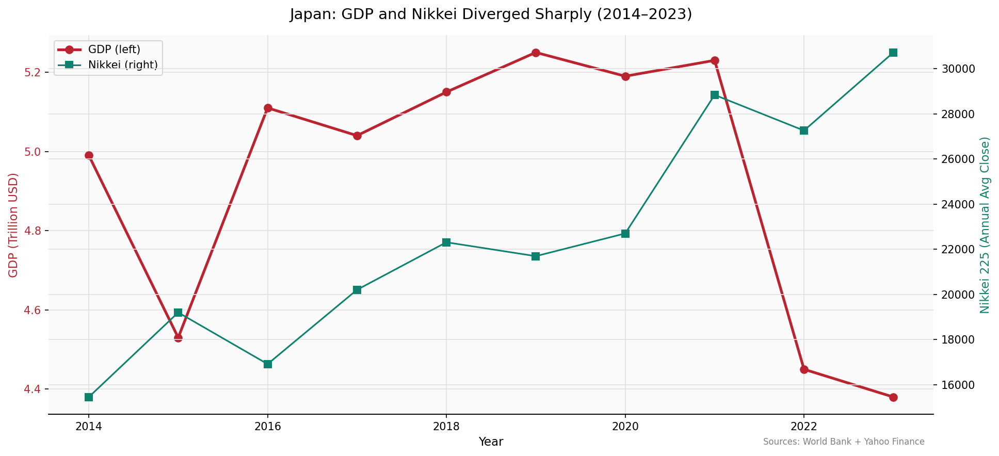

# JapanScope

*Testing whether Japan's economic health and its stock market actually move together — a macro-market intelligence system built as the market-side companion to [Japan Trade Intelligence](https://github.com/Prashant-4527/japan-trade-intelligence).*

---


## Overview

This project analyzes ten years (2014–2023) of Japan's macroeconomic indicators against market performance, pulling live data from three independent sources — Yahoo Finance, the World Bank, and FRED — across GDP, inflation, unemployment, the USD/JPY exchange rate, the BOJ policy rate, and three market benchmarks (Nikkei 225, Toyota, Sony). Most analyses of a country's economy assume growth and market performance move together. This project asks a sharper question: **does Japan's underlying economic health actually predict its market behavior, or can the two tell completely different stories?** The analysis moves from decade-level correlation testing, through event-specific shocks (the COVID crash, the 2022 yen–inflation chain), to a composite Recovery Score that gets checked against its own components rather than reported at face value.

## Why This Project

Most macro-vs-market comparisons stop at a correlation chart and a one-line conclusion. This one is built to stress-test its own numbers: the strongest correlation in the entire matrix (GDP vs. USD/JPY, -0.91) turns out to be a *measurement artifact* of how GDP gets converted into dollars, not a real economic relationship — and the project reports that instead of presenting -0.91 as the headline result. The same scrutiny extends to the engineering side: a FRED series returned a Bank of Japan rate that was flat at 0.3% for 120 straight months. Rather than just switching series and moving on, the bug was documented and turned into a permanent regression test (`tests/test_pipeline.py`) so it can't silently reappear. Where possible, findings are also checked against [Japan Trade Intelligence](https://github.com/Prashant-4527/japan-trade-intelligence)'s trade-flow data instead of standing alone — Toyota and Sony's differing yen-sensitivity here lines up with that project's automotive-surplus / electronics-deficit split, the same structural pattern showing up twice from two independent data sources.

## Key Findings

- **GDP and Nikkei moved in opposite directions (-0.36 correlation).** A weakening yen explains the split: it inflates yen-denominated profits for export-heavy Nikkei names like Toyota while making energy imports costlier in yen terms, which drags GDP down. In 2022, GDP fell from $5.23T to $4.45T while the Nikkei stayed near its decade high — an investor watching only the index would have read the opposite of what GDP was showing.
- **The single strongest correlation in the dataset isn't a real signal.** GDP vs. USD/JPY comes out at -0.91, but that's mechanical: Japan's GDP is measured in yen, then divided by the exchange rate to report in USD, so a weakening yen mechanically drags the *reported* figure down regardless of the underlying economy. Reporting this as an economic "finding" rather than flagging the artifact would have been the wrong call.
- **Pure exporters track the yen more tightly than diversified businesses.** USD/JPY correlates at +0.63 with Toyota versus +0.43 with Sony. This isn't an isolated observation — it mirrors Japan Trade Intelligence's finding that Japan runs a +$132bn automotive surplus against a -$13bn electronics deficit; the same structural export weakness shows up again here, in individual stock behavior.
- **A composite "recovery" score can hide the decline sitting inside it.** Japan's equal-weighted Recovery Score climbed from 100 (2014) to 141.5 (2023) — a strong-looking number. But the GDP component alone *fell* to 87.8 over the same period; the composite only looks healthy because Nikkei's outsized 198.7 index pulls the average up and buries GDP's real decline.
- **2016, not 2020, was Japan's most volatile market year.** 30-day rolling volatility peaks at 1.650 in 2016 — above COVID's 1.439 — driven by the BOJ's surprise negative-rate policy in January and the Brexit vote landing five months later in the same year. Volatility and "the crisis everyone remembers" don't always line up.

The full write-up — 10 findings, 3 recommendations, and 3 explicitly documented limitations — is in [`reports/executive_summary.md`](reports/executive_summary.md).

## Project Structure

```
JapanScope-Stock-Economic-Intel/
├── data/
│   ├── raw/                     # Yahoo Finance / World Bank / FRED pulls, saved as CSV snapshots
│   └── processed/                # annual_master, annual_enriched, recovery_scores
├── notebooks/
│   ├── 01_pipeline.ipynb         # Data collection: yfinance + World Bank + FRED, cleaning, validation
│   ├── 02_macro_market.ipynb     # 5 hypothesis-driven correlations + full 8-variable heatmap
│   ├── 03_event_analysis.ipynb   # COVID crash window, 30-day volatility, composite Recovery Score
│   └── 04_dashboard.ipynb        # Curated executive-dashboard notebook — the 4 headline findings only
├── reports/
│   ├── executive_summary.md      # Full write-up — start here
│   └── *.png                     # All saved charts
├── tests/
│   └── test_pipeline.py          # Data-integrity tests, incl. a regression test for a real bug found mid-project
├── Dockerfile
├── requirements.txt
└── README.md
```

## How to Run

1. **Clone the repository**
   ```bash
   git clone https://github.com/Prashant-4527/JapanScope-Stock-Economic-Intel.git
   cd JapanScope-Stock-Economic-Intel
   ```

2. **Install dependencies**
   ```bash
   pip install -r requirements.txt
   ```
   Or build the included Docker image instead:
   ```bash
   docker build -t japanscope .
   docker run -p 8888:8888 japanscope
   ```

3. **Get a free FRED API key** (needed for the USD/JPY and BOJ-rate pulls in notebook 01)
   - Register at https://fred.stlouisfed.org/docs/api/api_key.html
   - Save it in a `.env` file at the project root rather than pasting it into a notebook:
     ```bash
     FRED_API_KEY=your_key_here
     ```
   World Bank and Yahoo Finance data need no key.

4. **Run notebooks in order:** `01 → 02 → 03 → 04`
   Each notebook loads fresh from `data/raw/` or `data/processed/` instead of sharing kernel state — the same discipline as Japan Trade Intelligence.

5. **Run the test suite (optional)**
   ```bash
   pytest tests/
   ```

6. **Read [`reports/executive_summary.md`](reports/executive_summary.md)** for the full analysis, or open `notebooks/04_dashboard.ipynb` for the four-chart narrative version.

## Data Source

- **Yahoo Finance** (via `yfinance`) — daily prices for the Nikkei 225 (`^N225`), Toyota (`TM`), and Sony (`SONY`), 2014–2023
- **World Bank** (via `wbgapi`) — Japan's GDP (current USD), inflation, and unemployment: indicators `NY.GDP.MKTP.CD`, `FP.CPI.TOTL.ZG`, `SL.UEM.TOTL.ZS`
- **FRED** (Federal Reserve Bank of St. Louis) — the USD/JPY exchange rate (`DEXJPUS`) and a BOJ policy-rate proxy (`IR3TIB01JPM156N`). https://fred.stlouisfed.org
- **Coverage:** 2014–2023 — annual frequency for cross-indicator comparison, daily for event-window analysis

## Methodology Highlights

- **Full 8-variable correlation heatmap**, run after 5 individually hypothesized relationships — this is what surfaced the GDP/USD-JPY mechanical link (-0.91) as a byproduct, not something anyone went looking for.
- **A live data bug caught, fixed, and locked in as a test.** `IRSTCB01JPM156N` returned a flat 0.3% BOJ rate across all 120 months; switched to `IR3TIB01JPM156N` (3-month interbank rate) after diagnosing the flat series, then added `test_boj_rate_has_variation()` so the same bug can't silently corrupt results again.
- **The Recovery Score is checked against its own inputs, not reported standalone** — GDP, Nikkei, and unemployment are indexed to a common 2014 base (unemployment inverted so higher is always "better"), which is what exposed that the composite and its GDP component tell opposite stories.


## Author

**Prashant** ([@Prashant-4527](https://github.com/Prashant-4527))
BCA student, University of Commerce College, Jaipur — building toward METI IPA 2027.
